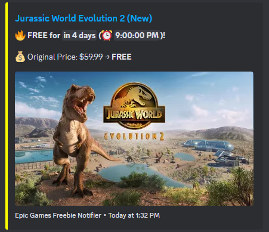

# EpicGames-Freebie-Notifier 🎮  
EpicGames-Freebie-Notifier is an automated tool that fetches and notifies about free games from the Epic Games Store using Discord Webhooks. It provides real-time countdowns, ensuring you never miss a deal. The system prevents duplicate notifications by tracking previously posted games and only sending updates when necessary. Fully automated with GitHub Actions, it runs daily to keep your data fresh and accurate.


## Features 📌
✅ **Live Digital Countdown**  
- Displays a real-time countdown (`⏳ Free for 2 days, 3 hours (⏰ 14:45:00)`) in Discord messages.  

✅ **Daily Free Game Updates**  
- Automatically fetches **free games from Epic Games Store** and notifies on Discord.  
- Uses the [Epic Games API](https://store-site-backend-static.ak.epicgames.com/freeGamesPromotions).  

✅ **No Duplicate Notifications**  
- Sends a notification **only if**:
  - A new game is available.  
  - The expiration time changes.  

✅ **Rich Discord Messages**  
- Well-formatted embeds with:
  - Game title & link  
  - Original price & discount  
  - Countdown timer  
  - Game cover image  

✅ **GitHub Actions Integration**  
- Runs **daily at 12:00 AM UTC** to fetch new data.  
- Keeps data updated without manual intervention.  

---

## Installation & Setup
### Fork & Clone the Repository
```bash
git clone https://github.com/nayandas69/EpicGames-Freebie-Notifier.git
cd EpicGames-Freebie-Notifier
```

### Set Up Discord Webhook in GitHub
1. **Create a Webhook in Discord:**  
   - Go to **Server Settings** → **Integrations** → **Create Webhook**.  
   - Copy the **Webhook URL**.  

2. **Add Webhook to GitHub Secrets:**  
   - Go to your **GitHub repository** → **Settings** → **Secrets and variables** → **Actions**.  
   - Click **New repository secret** → Name it **`DISCORD_WEBHOOK`**.  
   - Paste the **Webhook URL** → Click **Add secret**.

### Run Locally
To manually check free games, run:
```bash
python main.py
```

---

## How It Works
1. **Fetch Free Games:**  
   - Uses Epic Games API to check free games.  
   - Extracts title, image, price, and expiration date.  
   
2. **Check Expiration:**  
   - Converts expiration time to a **live countdown** (`<t:TIMESTAMP:R>`).  
   
3. **Send to Discord:**  
   - If a new game is found, it **sends a notification**.  
   - If expiration time changes significantly, it **updates the message**.  

4. **Prevents Duplicate Alerts:**  
   - Uses `epics.json` to **track previously posted games**.  
   - Only **sends updates if something changes**.  


## API Used
### Epic Games API 🎮:
- **Endpoint:** `https://store-site-backend-static.ak.epicgames.com/freeGamesPromotions`
- **Purpose:** Fetches free games and their expiration times.  
- **Data Extracted:**
  - `title`: Game name  
  - `productSlug`: Game URL  
  - `price`: Original & discount price  
  - `endDate`: Offer expiration time  


## GitHub Actions Automation
### **Daily Workflow (Runs at 12:00 AM UTC)** ⏳
- **Fetches new free games** from Epic Games Store.  
- **Updates `epics.json`** if new games or changes are found.  
- **Sends notifications to Discord** for new or updated games.


## 📝 Example Discord Message

 


## Contributing
Want to improve this project? Feel free to submit a pull request!  


## License 
This project is open-source and licensed under the `MIT`.  

For more details, read the [LICENSE](LICENSE) file.