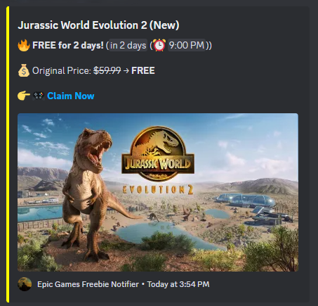

# EpicGames-Freebie-Notifier 🎮 

EpicGames-Freebie-Notifier is an **automated tool** that fetches and notifies about **free games** from the **Epic Games Store** via **Discord Webhooks**. It provides **real-time countdowns**, ensuring you never miss a deal. The system prevents duplicate notifications by tracking previously posted games and **only sends updates when necessary**. Fully automated with **GitHub Actions**, it runs **daily** to keep your data fresh and accurate.  


### Updates & Fixes:  
- **Better Rich Embeds:** Now includes a **"Claim Now"** button for quick access.  
- **Optimized Countdown Timer:** Shows a **live countdown** (`⏳ Free for 2 days (⏰ 14:45:00)`).  
- **More Accurate Expiration Tracking:** Fixed minor issues with end timestamps.  
- **Error Handling Improved:** Prevents failures when Epic Games' API is down.  


## Features 📌  

✅ **Live Countdown Timer**  
- Shows a real-time countdown (`⏳ Free for 3 days, 2 hours`).  

✅ **Automatic Free Game Notifications**  
- Fetches **free games from Epic Games Store** and notifies on Discord.  
- Uses the [Epic Games API](https://store-site-backend-static.ak.epicgames.com/freeGamesPromotions).  

✅ **No Duplicate Spam**  
- Sends notifications **only when**:  
  - A **new** free game appears.  
  - The **expiration date changes**.  

✅ **Rich Discord Embeds**  
- Includes:  
  - 🎮 Game Title & Status(New or Expiration!)  
  - 💰 Original Price & Discount  
  - ⏳ Countdown Timer  
  - 🖼️ Cover Image  
  - 🎯 "Claim Now" Button With Link

✅ **Fully Automated with GitHub Actions**  
- **Runs every day at 12:00 AM UTC** to fetch new games.  


## How to Set Up? 

### 1. Fork & Clone the Repository  
```bash
git clone https://github.com/nayandas69/EpicGames-Freebie-Notifier.git
cd EpicGames-Freebie-Notifier
```

### 2. Add Discord Webhook to GitHub  
1. **Create a Webhook in Discord:**  
   - Go to **Server Settings** → **Integrations** → **Create Webhook**.  
   - Copy the **Webhook URL**.  

2. **Add Webhook to GitHub Secrets:**  
   - Go to your **GitHub repository** → **Settings** → **Secrets and Variables** → **Actions**.  
   - Click **New Repository Secret** → Name it **`DISCORD_WEBHOOK`**.  
   - Paste the **Webhook URL** → Click **Add Secret**.  

### 3. Run It Locally (Optional)  
To manually check free games, run:  
```bash
python main.py
```


## How It Works? 

1. **Fetch Free Games:**  
   - Uses Epic Games API to check free games.  
   - Extracts title, image, price, and expiration date.  

2. **Check Expiration:**  
   - Converts expiration time to a **live countdown** (`<t:TIMESTAMP:R>`).  

3. **Send to Discord:**  
   - If a **new game** is found, it **sends a notification**.  
   - If expiration time changes, it **updates the message**.  

4. **Prevents Duplicate Alerts:**  
   - Uses `epics.json` to **track previously posted games**.  


## Don't Want to Fork & Set Up?  

### Just Join My Discord & Get Free Game Notifications Automatically!  
Click the button below to **join my Discord server**, and you'll receive **free Epic Games notifications instantly!**  

> **[Join Now](https://discord.gg/skHyssu)**  

Get notified without **any setup or coding**!  


## Epic Games API  

This project **fetches free games** from the **Epic Games API**:  

- **API Endpoint:**  
  - [`https://store-site-backend-static.ak.epicgames.com/freeGamesPromotions`](https://store-site-backend-static.ak.epicgames.com/freeGamesPromotions)  

- **Data Extracted:**  
  - `title`: Game name  
  - `productSlug`: Game URL  
  - `price`: Original & discount price  
  - `endDate`: Offer expiration time  

> Official API Docs📄: [Epic Games API Documentation](https://dev.epicgames.com/docs)  


## Example Discord Message  

 


## Contributing  

Want to improve this project? Feel free to **submit a pull request**!  


## License

This project is open-source and licensed under **MIT**.  

For more details, read the [LICENSE](LICENSE) file.  